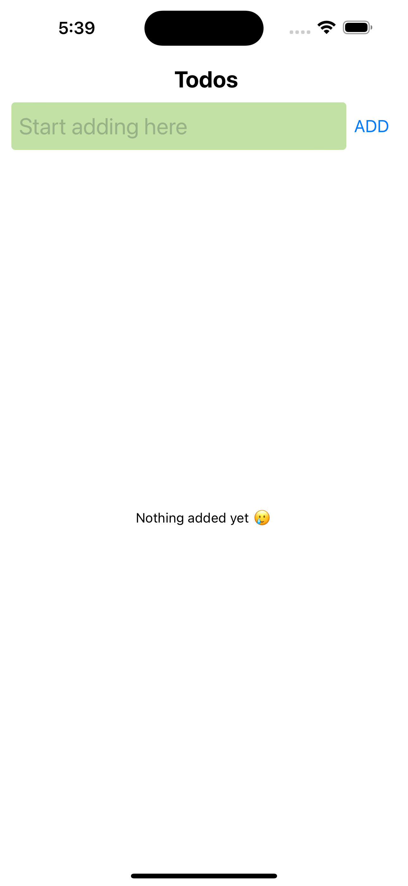
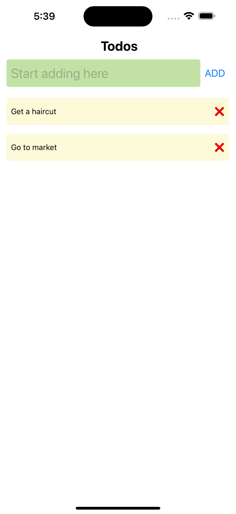

# To-Do App 📝

This is a simple To-Do app built using **React Native**. The app allows users to add tasks, view the list of tasks, and delete them from the list. It focuses on user input handling and dynamic rendering of task lists.

---

## Features ✨

- Add new tasks to the to-do list.
- View all the added tasks in a scrollable list.
- Delete tasks from the list by pressing ❌.

---

## Screenshots 📸

### 1. Main Screen (Task List)



### 2. Add Task Screen



---

## How to Run 🏃‍♂️

1. Clone the repository:

   ```bash
   git clone https://github.com/anirudhsingh8/todo-app.git
   ```

2. Navigate to the project directory:

   ```bash
   cd todo-app
   ```

3. Install dependencies:

   ```bash
   npm install
   ```

4. Run the app on an Android or iOS simulator:
   ```bash
   npm start
   ```

---

## Concepts Used 💡

- **State Management**: Managed task list with `useState`.
- **User Input**: Handled text input for adding new tasks to the list.
- **Dynamic Lists**: Displayed the list of tasks dynamically using `FlatList`.
